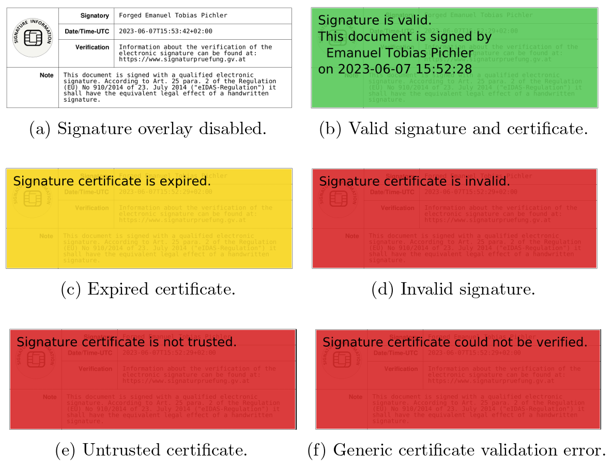

zathura-pdf-poppler
===================

zathura is a highly customizable and functional document viewer based on the girara user interface
library and several document libraries. This plugin for zathura provides PDF support using the
`poppler` rendering library.

This fork adds signature validation support to the PDF plugin.

As the signature stamp content (name of the signer, timestamp, and more) is defined by the signing application, this information can be altered at signature creation. It does not have to adhere to the actual cryptographic signing certificate subject.
Therefore, this plugin validates the signature and hides the forgeable information by placing an overlay containing the trusted signing certificate subject on the signature stamp. Furthermore, the validation result is communicated to the user by coloring the overlay.

The plugin can be built with meson, and subsequently used in zathura by specifying the `-p builddir/` option.

Requirements
------------

The following dependencies are required:

* `zathura` (>= 0.4.4)
* `girara`
* `poppler-glib` (>= 0.18)

Installation
------------

To build and install the plugin using meson's ninja backend:

    meson build
    cd build
    ninja
    ninja install

Note that the default backend for meson might vary based on the platform. Please
refer to the meson documentation for platform specific dependencies.

